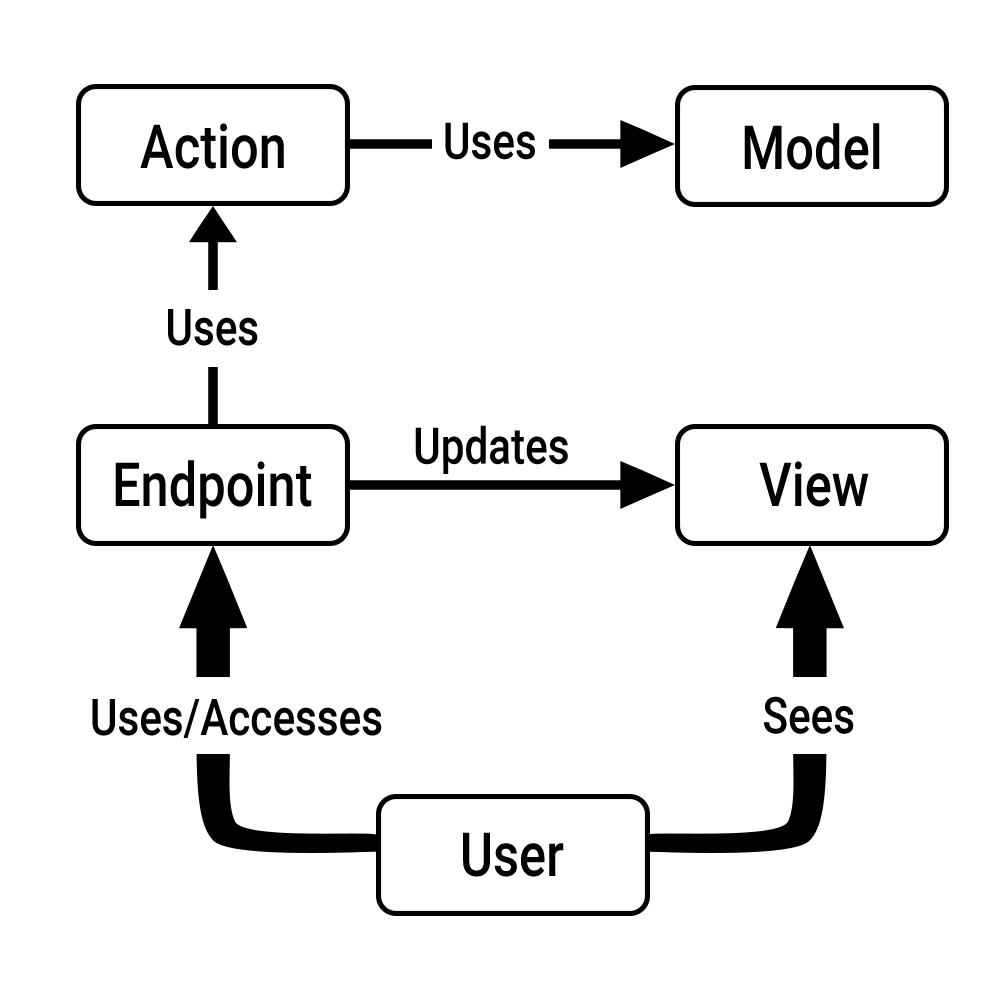

# MVEA Architectural Pattern

## Name

***MVEA***, which stands for **M**odel **V**iew **E**ndpoint **A**ction. In the world of web development, it might also be referred to as ***MVRA***, which stands for **M**odel **V**iew **R**oute **A**ction.


## Problem

Need of a way to separate the use of data from its source, its manipulation as well as how it is provided to the end user.


## Solution

***MVEA*** is a derived form of [***MVC***](https://en.wikipedia.org/wiki/Model%E2%80%93view%E2%80%93controller). It divides the application in four parts :

* The **model** which is directly responsible for managing the application's data
* The **view** which is a representation of the **model** in a particular format
* The **endpoint**(s) which is(are) the main interaction(s) with the end user, it is the set of available behavior
* The **action** which manipulates and updates the **model**, it is the main logic behind all available behavior


Below is a graph describing the general functioning of a generic application that uses the ***MVEA*** pattern :

<center></center>

### General

While **endpoints** represent the points of interaction in the user interface, it is the **actions** that do the heavy lifting, **endpoints** being there solely as a "skeleton" of code which depends on the "muscles" that are the **actions**.


### Model

As in ***MVC​*** the **model** is responsible for providing, holding and accessing data. It is usually the component that deals with interfacing with the application's data source/database.


### View

The **view** is what is delivered to the end user. Usually done via a [GUI](https://en.wikipedia.org/wiki/Graphical_user_interface), it exposes the data in a given format as well as providing the end user with ways to interact with/manipulate it.


### Endpoint

The **endpoint** describes how a given interaction between the user and the **model** should be executed. It usually relies on a declarative style since all the heavy lifting is done by the **actions** it uses.

Unless there is a binding between **model** and **view** (e.g. with modern web frameworks), the **endpoint** is also responsible for updating the view if there is a need to do so.


### Action

**Actions** tend to be reused in other contexts (e.g. in middlewares), one more reason for separating them from **endpoints** : it makes more sense since we only want to borrow some behavior, not the entire **endpoint**'s logic.

They provide a given set of tools for a *specific* need (e.g. authentication, security, session management, etc...).


## Consequences

***MVEA*** allows more separation of concerns than regular ***MVC*** due to the decoupling of what would have been the **controller**. Often in ***MVC*** you are forced to write "helper classes" to abstract away most of the heavy lifting. In this scenario, the **controller** usually becomes the **endpoint** and the **helper classes** the **actions**.


## Exemples

Let's use a fictitious programming language to demonstrate the use of ***MVEA***. As **models** and **views** are already common (cf. [***MVC***](https://en.wikipedia.org/wiki/Model%E2%80%93view%E2%80%93controller), [***MVVM***](https://en.wikipedia.org/wiki/Model%E2%80%93view%E2%80%93viewmodel), etc...) and easy to grasp, I will only focus on the endpoints here. **Actions** are also relatively easy to grasp (the name is enough to imagine the implementation) and I will therefore not cover them.


Actual full examples will be provided as subdirectories that you are free to explore.


### Web development

```js
import Namespace
import Status
import DI
@Namespace import Action

const app = App(env["DB", "SSL_CERT", "SSL_KEY"]);
app.setRenderer( Views(env["VIEWS_ROOT", ""]) );
DI::bootstrap(app, env["DI_CONFIG_FILE"]); //use Dependency Injection via app, for app
app.bootstrapDB().bootstrapSSL().useRouteNamesFirst();
```


```js
@DI($flash = Actions::Flash)
app.get("/", (req, res) => {//endpoint
    return this.render("home", ["flash": $flash.consumeAll()]);
}).name("home");
```


```js
@DI($auth = Actions::Auth, $flash = Actions::Flash)
app.get("/login", (_, res) => {//endpoint
    if($auth.isAlreadyLogged())
        return res.to("home").withFlash(info: "already logged in");
    
    return this.render("login", ["flash": $flash.consumeAll()]);
}).name("login");
```


```js
@DI($auth = Actions::Auth, $valid = Actions::Valid, $hash = Actions::Hash)
app.post("/login", (req, res) => {//endpoint
    const err = !$valid.exists(req["username", "password", "pconfirm"]);
    if(err)
        return Status::BadRequest;
    
    if($auth.isAlreadyLogged())
    	return Status::Forbidden;
    
    const post = req["username", "password", "pconfirm"];
    if(post["password"] != post["pconfirm"])
        return res.to("login").withFlash(error: "passwords don't match");
    
    const [usn, pwd] = post["username", "password"];    
    const user = $auth.login(usn, $hash.hash(pwd));
    if(user){
        Auth.setUser(user);
        return res.to("home").withFlash(success: "logged in successfully");
    }else
        return res.to("login").withFlash(error: "invalid credentials");
}).name("login.post");
```


```js

const http = "localhost:80";
const https = "localhost:443";
app.transfer(from: http, to: https).listen([http, https]);
```


As you can see above, most of the logic is written down without any implementation. Most of the code is either branching or error handling : it is not entirely focused on the actual logic behind everything but more on how to orchestrate it.


### Desktop application

```js
import Namespace
import DI
import Endpoint
import LoginView
import HomeView
import GUI::AbstractInput;
@Namespace import Models
@Namespace import Actions
@Namespace import Errors

@DI($auth = Actions::Auth, $hash = Actions::Hash, $views = Actions::Views)
export class LoginEndpoint : Endpoint{
    public:
    	@Static
        @Endpoint::anchor(class = LoginView)
        handler attach = (LoginView view) => {
            const inputs = [
            	view.get("Input/username"),
            	view.get("PasswordInput/password"),
            	view.get("PasswordInput/pconfirm")
            ].map(e => cast<AbstractInput>(e));
            /*Think of this as a magical autowiring of inputs' values*/
            const bound = $views.bind(this::attemptLogin, inputs);
            
            view.get("Button/login").on("click", bound);
            //attach it to the button
            //but you can also attach it to each input field
            inputs.forEach(input => input.on("enterPressed", bound));
        };
    
        void attemptLogin(string username, string password, string pconfirm){
            if($auth.isAlreadyLogged())
                throw Errors::InvalidState("Attempt to log in while logged in");
            
            if(password != pconfirm){
                $views.flash.push(error: "Passwords don't match");
            	return;
            }
            
            const pwd = $hash.hash(password);
            const user = $auth.login(username, pwd);
            if(user){
                $auth.setUser(user);
                $views.flash.pushAfterSwap(success: "Successfully logged in");
                $views.swapTo(class: HomeView);
                return;
            }
            
            $views.flash.push(error: "Invalid credentials");
        }
};
```

Here again, no implementation and just layout. Once all the implementation details are abstracted away in **actions** all we have left is error handling and "side effects" on the **view(s)**.